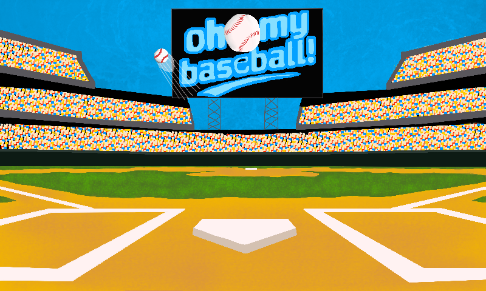
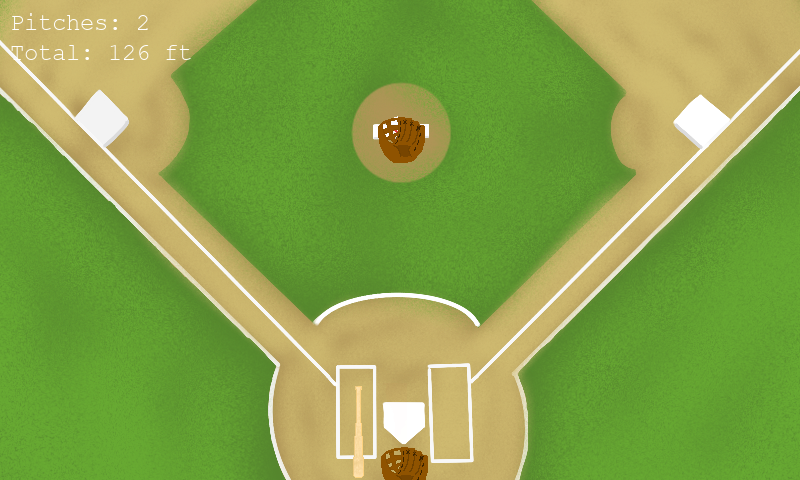

# Oh My Baseball

Oh My Baseball is a lightweight arcade-style batting game built with Python and Pygame. Start from the menu, choose a mode, and time your swing as each pitch approaches the plate. Hits add to your distance total, which can be spent in the shop on upgrades.

## Gameplay preview





## Features

- Single-player batting gameplay with timing-based swings
- Randomized pitch motion and ball flight
- Distance tracking in feet
- Foul detection and a game-over flow after a limited number of pitches
- Shop upgrades for batting, contact, pitch count, and distance
- Persistent stats and progress saved in JSON files

## Run the game

The game files are in `Oh-My-Baseball-main`. From the repository root, run:

```bash
cd Oh-My-Baseball-main
python -m pip install pygame
python Oh_My_Baseball.py
```

## Controls

- `Space`: pitch the ball or swing at the plate
- Mouse click: select menu and shop buttons, or return to the menu after game over

## Project structure

- `Oh-My-Baseball-main/Oh_My_Baseball.py` — main game loop and mode switching
- `Oh-My-Baseball-main/Data/playone.py` — pitch logic, swing timing, scoring, and gameplay UI
- `Oh-My-Baseball-main/Data/TitleScreen.py` — title screen and menu
- `Oh-My-Baseball-main/Data/Shop.py` — upgrades and shop progression
- `Oh-My-Baseball-main/Data/Assets/sprites/` — game art and animations
- `Oh-My-Baseball-main/Data/playerStats.json` — player upgrade stats
- `Oh-My-Baseball-main/Data/playerFt.json` — saved distance total
- `Oh-My-Baseball-main/Data/costs.json` — shop upgrade costs
